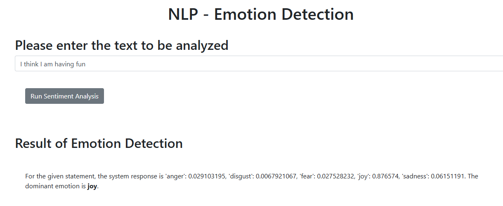

# **Emotion Detector**

A simple **Emotion Detection** project using IBM Watson NLP. This tool analyzes text input and identifies the **dominant emotion** (e.g., joy, sadness, anger).

### **Features**  
✅ Text-based emotion analysis  
✅ Powered by **IBM Watson NLP**  
✅ Easy-to-use Python implementation  

### **Setup & Usage**  
1. Clone the repo:  
   ```bash
   git clone https://github.com/D-Kumar19/emotion_detector.git
   cd emotion_detector
   ```  
2. Run the script:  
   ```python
   python emotion_detection.py "Your text here"
   ```  

---



Happy Coding!!!
